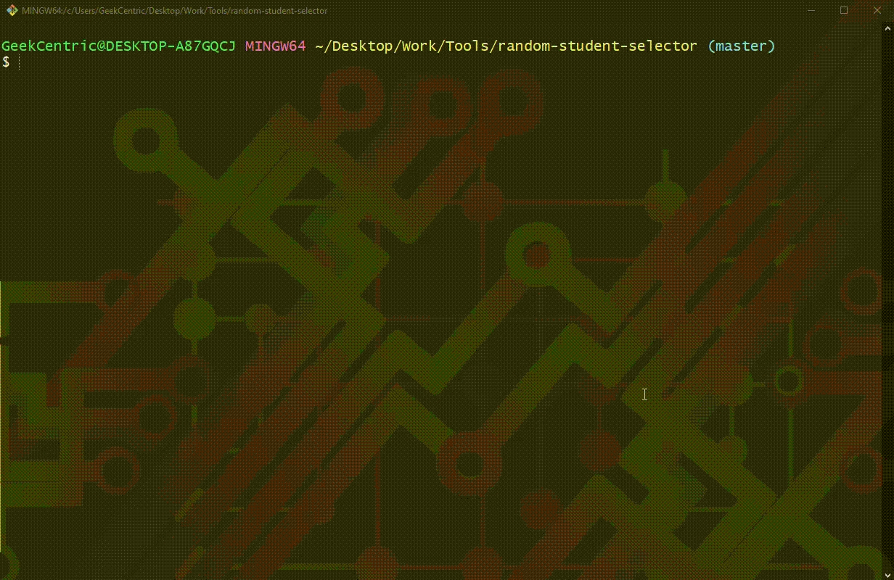

# Random Student Selector

This console tool will let teachers add students to a database, drop specific or all students, and choose a random student (cold call).

# Motivation

I want to make sure everyone gets called in class so everyone can participate. As a teacher I need to be able to add students to my class, make sure everyone gets called. I also need to be able to delete specific users if they drop midway and at the end of the cohort I need to delete everyone to make way for the new class.

# Build Status

Program is working and in use in my classroom

# Requirements

- NodeJS
- MongoDB

# Setup

- clone to computer using:

```
git clone https://github.com/TS22082/random-student-selector.git
```

- run npm install from inside project folder. (Where app.js is)

- From inside project folder type:

```
node app.js
```

\*\*\*Note:
A mongodb database instance named "student-selector" will be created

\*\*\*Optional

Use pkg from npm to make an executable. Add to system variables to make executable from any folder from terminal

# Instructions

## Adding Students

You will need to add students before you can select a random student or drop a student. Trying to access either menus issue an error nd redirect you to main menu

select "Add Student(s)" then Add Students(s) again to confirm
add as many students as you'd like seperated by coma

## Dropping Students

You can select which students to drop or drop all students at once.
To select students use arows to focus on student name then press space bar to select. You can also toggle all students with "a" or invert the selection with "i".

You can choose to delete noone by pressing enter with noone selecte

## Choosing students at random

The program will make sure noone is called twice before going through entire student list.
Select "Enter Random Student Selector"
Choose "Pick Student" to make acid cow choose a student at random


